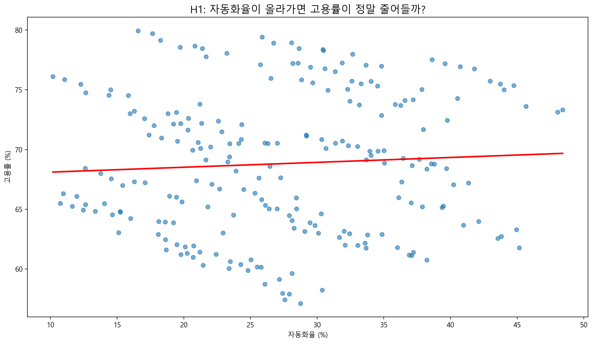
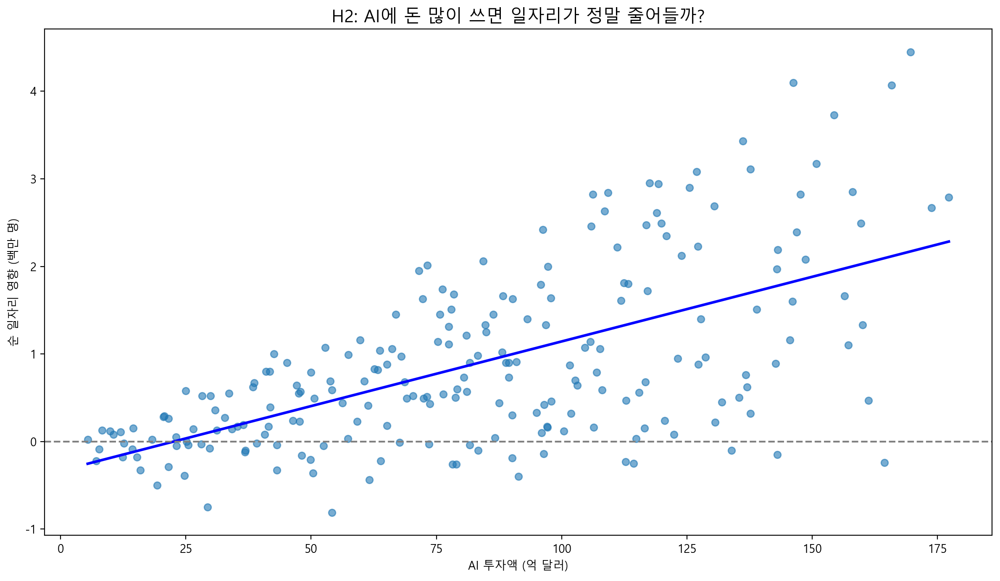
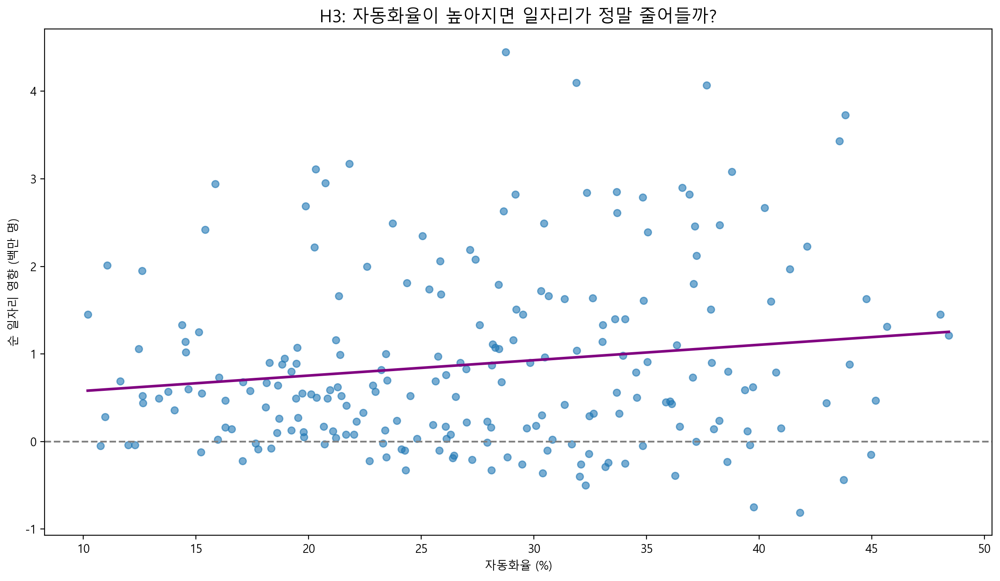
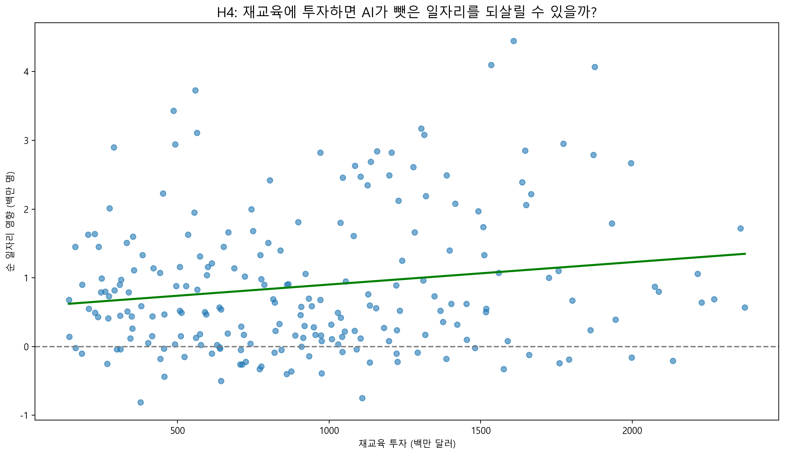
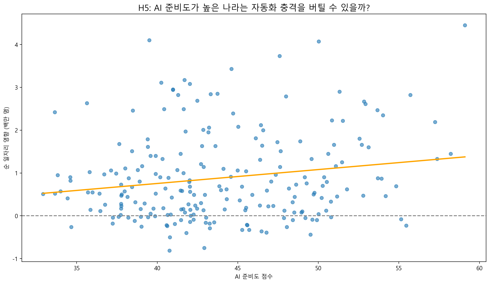
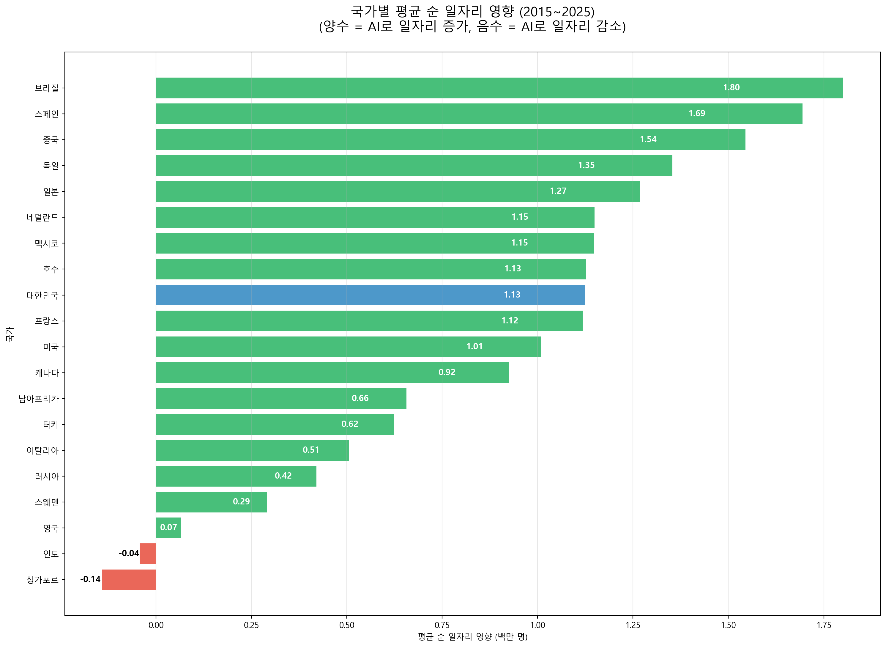

# AI가 고용시장에 미치는 영향에 대한 분석 (2015-2025)

**AI가 전 세계 일자리에 미치는 영향 분석**

이 프로젝트는 2015~2025년 기간 동안 주요 20개국의 AI 투자, 자동화율, 고용률, 재교육 투자 등을 분석하여  
**"AI가 정말 일자리를 없애는가?"** 라는 질문을 데이터로 검증합니다.

---

## 🛠 기술 스택

Python 3.9+
pandas, matplotlib, seaborn

## 📋 프로젝트 개요

### 분석 가설

- **H1.** 자동화율이 올라가면 고용률이 정말 줄어들까?
- **H2.** AI에 돈을 많이 쏟을수록 일자리가 줄어들까?
- **H3.** 자동화율이 높아질수록 순 일자리 영향이 부정적일까?
- **H4.** 재교육에 투자하면 AI가 뺏은 일자리를 되살릴 수 있을까?
- **H5.** AI 준비도가 높은 나라는 자동화 충격을 버틸 수 있을까?
- **H5.** 국가별로 순 일자리 영향에 큰 차이가 있을까?

---

#### 상관관계 방향

- 약한 양의 상관관계를 보입니다.
- 자동화율이 높아질수록 순 일자리 영향이 **다소 증가**하는 경향이 나타납니다.

#### 회귀선 기울기

- 기울기가 완만하게 **위로** 향하고 있습니다.

#### 주요 특징

- 대한민국 데이터 포인트들은 자동화율이 상당히 높은 편(`30`~`41%`)인데, 순 일자리 영향은 **중상위권**에 위치해 있습니다.

> 자동화율이 올라가도 고용률은 거의 떨어지지 않고, 오히려 미세하게 상승하는 경향을 보인다.

---

#### 상관관계 방향

- 강한 양의 상관관계
- AI 투자액이 증가할수록 순 일자리 영향이 함께 증가하는 뚜렷한 양의 관계를 보입니다.

#### 회귀선 기울기

- 명확한 양의 기울기
- 회귀선이 왼쪽 아래(저투자·저영향)에서 오른쪽 위(고투자·고영향)로 **강하게 상승**하고 있습니다.
- 투자액이 늘어날수록 순 일자리 영향이 체계적으로 증가하는 경향이 강합니다.

#### 주요 특징

- AI 투자액 `100억 달러` 이상 구간부터 거의 모든 데이터가 **플러스 영역(+)** 에 위치
- 저투자 구간(`0`~`50억 달러`)에서는 마이너스 값도 일부 존재하지만, 투자액이 증가할수록 마이너스 점이 사라지고 양수 값의 크기와 분포가 확대
- 최고 투자 국가(`150`~`170억 달러`)에서는 순 일자리 영향 +4백만 명 이상의 높은 값이 다수 관찰
- 대한민국 데이터는 `60`~`140억 달러` 구간에 위치하며, 대부분 `+0.5` ~ `+3.5` 사이의 안정적인 **플러스 영역**에 있습니다.

> AI에 돈을 많이 투자할수록 일자리가 줄어드는 게 아니라 오히려 크게 늘어나는 강한 양의 관계가 확인된다.

---

#### 상관관계 방향

- 약한 양의 상관관계
- 자동화율이 높아질수록 순 일자리 영향이 **소폭 증가**하는 양의 관계를 보입니다.

#### 회귀선 기울기

- 완만한 양의 기울기
- 회귀선(보라색 선)이 왼쪽 아래 → 오른쪽 위로 **서서히 상승**하고 있습니다.

#### 주요 특징

- 자동화율 `30%` 이상 구간에서도 대부분의 점이 **플러스 영역(+)** 에 분포
- 자동화율이 낮은 구간(`10`~`20%`)에서는 마이너스 값이 비교적 많이 보이지만, 자동화율이 높아질수록 **마이너스 점이 줄어들고 플러스 값의 비중이 증가**
- 최고 자동화율 구간(`45%` 근처)에서도 순 일자리 영향은 `+1.2` ~ `+1.4` 정도로 안정적인 **플러스 영역** 유지
- 대한민국 데이터(자동화율 `31`~`41%`)는 그래프 오른쪽 상단 쪽에 위치하며, 대부분 `+0.5` ~ `+3.0` 사이의 양수 값을 기록

> 우려와는 달리, 자동화율이 높아져도 일자리가 크게 줄지 않으며, 오히려 약하지만 지속적인 순증 효과를 보이는 관계가 확인된다.

---

#### 상관관계 방향

- 약한 양의 상관관계
- 재교육 투자액이 증가할수록 순 일자리 영향이 **소폭 증가**하는 양의 관계를 보입니다.

#### 회귀선 기울기

- 완만한 양의 기울기
- 회귀선(초록색 선)이 왼쪽 아래 → 오른쪽 위로 **서서히 상승**하고 있습니다.

#### 주요 특징

- 재교육 투자액 `1,500백만 달러` 이상 구간부터 대부분의 점이 **플러스 영역(+)** 에 분포
- 저투자 구간(`0`~`800백만 달러`)에서는 마이너스 값(`-0.8` ~ `0`)이 상당히 많이 보이지만, 투자액이 증가할수록 **마이너스 점이 줄어들고 플러스 값의 비중이 높아짐**
- 최고 투자 구간(`2,000백만 달러` 이상)에서는 `+1` ~ `+4.5`까지 높은 양수 값이 다수 관찰
- 대한민국 데이터(재교육 투자 600~1,492백만 달러 구간)는 그래프 중간~우측에 위치하며, 대부분 `+0.5` ~ `+3.0` 사이의 **플러스 영역에 안정적으로 분포**

> 재교육에 투자할수록 일자리 순감소 위험을 줄이고 약하지만 꾸준한 순증 효과를 얻을 수 있는 관계가 확인된다.

---

#### 상관관계 방향

- 약한 양의 상관관계
- AI 준비도가 높아질수록 순 일자리 영향이 **소폭 증가**하는 양의 관계를 보입니다.

#### 회귀선 기울기

- 완만한 양의 기울기
- 회귀선(주황색 선)이 왼쪽 아래 → 오른쪽 위로 **서서히 상승**하고 있습니다.

#### 주요 특징

- AI 준비도 `50점` 이상 구간부터 **플러스 영역(+)** 점들의 비중이 뚜렷하게 증가
- 준비도가 낮은 구간(`35`~`42점`)에서는 마이너스 값(`-0.8` ~ `0`)이 비교적 많이 분포
- 최고 준비도 구간(`55`~`60점`)에서는 `+4.5` 수준의 **높은 양수 값**이 관찰됨
- 대한민국 데이터는 중상위 준비도 구간(약 `39`~`55점`)에 위치하며 대부분 **플러스 영역**에 안정적으로 분포

> AI 준비도가 높을수록 자동화 충격을 잘 버티고 순 일자리 증가 효과를 얻을 가능성이 높아지는 약한 양의 관계가 확인된다

---

#### 상관관계 방향

- 전체적으로 **강한 양(+)** 의 경향이 뚜렷합니다. (20개국 중 18개국이 플러스 영역)

#### 주요 특징

- 상위권 강세: 브라질(`1.80`), 스페인(`1.69`), 중국(`1.54`), 독일(`1.35`), 일본(`1.27`) 등 상위 5개국이 모두 `+1.27` 이상의 높은 순증 효과
- 대한민국: `+1.13` (파란색으로 강조 표시) → 상위 `8`~`9`위권, **중상위권**에서 안정적인 성과
- 미국: `+1.01` (중상위권)
- 하위권: 인도(`-0.04`), 싱가포르(`-0.14`) → 유일하게 순감소를 기록한 `2`개국
- 대부분 국가(`90%`)가 `+0.29` ~ `+1.80` 사이의 **플러스 영역**에 위치

> AI 시대에 대부분의 국가에서 순 일자리 증가 효과가 나타나며, 대한민국은 중상위권에서 양호한 성과를 보이고 있다. (싱가포르·인도 예외)

---

## 📈 주요 결론

- AI는 대부분의 국가에서 순 일자리 **증가 효과**를 보입니다.
- 대한민국은 **중상위권** 성과를 기록했습니다.
- 재교육 투자와 AI 준비도가 높은 국가일수록 AI 전환에서 **유리**합니다.
- 인도, 싱가포르 등 일부 국가는 **순감소 위험**이 있습니다.

## 📌 우리나라가 나아갈 방향

- 재교육 투자 대폭 확대
- AI 준비도(인프라·인재·정책) 동시 강화
- 순감소 위험 국가(인도·싱가포르 등)의 사례를 참고한 선제적 전략 수립
